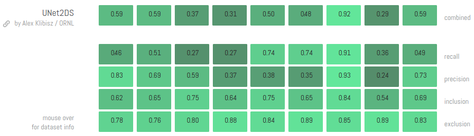
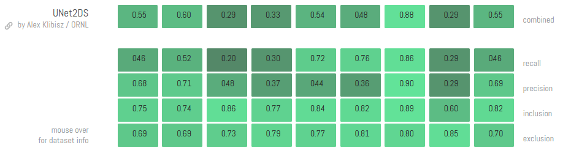

# deep-calcium
Deep Learning Models for Calcium Imaging Data

## Models: Neuron Segmentation

### UNet2DS: UNet with 2D Summary Images

- Slightly-modified UNet model trained on Neurofinder labeled datasets with no problem-specific pre- or post-processing.
- Implemented with Keras using Tensorflow backend.
- [Training, submission artifacts on Dropbox.](https://www.dropbox.com/sh/ewggs4ivbydonkt/AABaPzP7pWvM9pQS-RbBRbgza?dl=0)
- [Pre-trained weights `weights_loss_val.hdf5`](https://www.dropbox.com/sh/ewggs4ivbydonkt/AABjLafLAy8Es6iCtQQojKp1a/weights_loss_val.hdf5?dl=1), md5sum ee6665a3ee189ecd6ed26ba3e0b1258f.

- Latest implementation scored 0.5155 on Neurofinder competition, submission md5sum 9a57a241db0d25f4f441b637690c41f1.

- Previous implementation (Keras + Theano) scored 0.5011.

