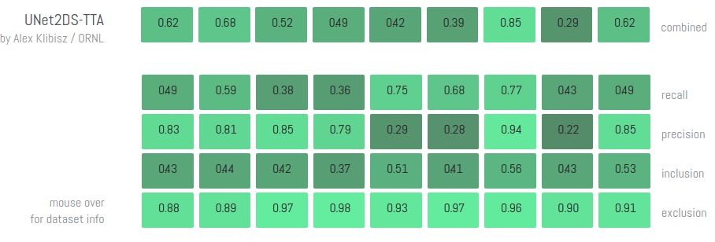
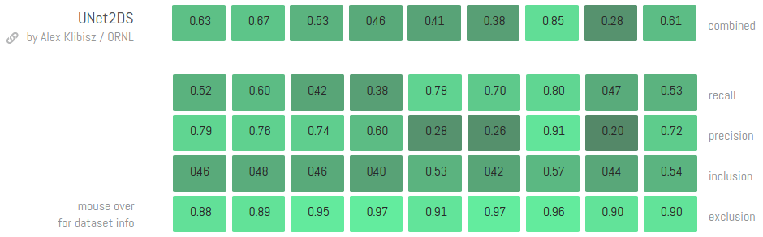

# deep-calcium
Deep Learning Models for Calcium Imaging Data

## Setup and Example

This will be streamlined in the future.

```
# Clone the repository.
git clone https://github.com/alexklibisz/deep-calcium && cd deep-calcium

# Setup a virtual environment (google "virtual env wrapper").
mkvirtualenv deep-calcium

# Install dependencies inside the virtual environment.
pip install --upgrade pip
pip install -r requirements.txt

# Make data and checkpoints directories.
mkdir data
mkdir checkpoints

# Run one of the examples - training UNet2DS on neurofinder.00.00 dataset.
# Open the script and read the code to understand what's happening.
CUDA_VISIBLE_DEVICES="0" python examples/unet2ds_nf.py train neurofinder.00.00

```

## Models: Neuron Segmentation

### UNet2DS: UNet with 2D Summary Images

- Trained on Neurofinder labeled datasets with no problem-specific pre- or post-processing.
- Implemented with Keras using Tensorflow backend.
- Latest implementation for the Neurofinder competition scored **0.5356 without test-time augmentation** and **0.5422 with test-time augmentation.**
  - Commits: [0bda9d4](https://github.com/alexklibisz/deep-calcium/commit/0bda9d4b9cad71fb3685671c2e699c88d9195a24), [f1b33bf](https://github.com/alexklibisz/deep-calcium/commit/f1b33bfe48425d0d7a33f7f74ded19905a24b88f)
  - Submission md5sum d9b47b2c42e4f04cfd76b308b79680a6 (0.5356), 708add7dbd42455d99bb5eb3fe515e49 (0.5422).
  - [Training, submission artifacts on Dropbox.](https://www.dropbox.com/sh/tqbclt7muuvqfw4/AADET6ZVlUbHZsqHKgwDOysXa?dl=0)
  - [Pre-trained weights `weights_val_nf_f1_mean.hdf5`](https://www.dropbox.com/sh/tqbclt7muuvqfw4/AACqVVA8oJlZNIYvfc6x6gO2a/weights_val_nf_f1_mean.hdf5?dl=1), md5sum ffaa4c3a5110eae024114d3fbdd438f2.
  - [Pre-trained model architecture with weights `model_val_nf_f1_mean.hdf5`](https://www.dropbox.com/s/x5bv4klz16ai6wa/model_val_nf_f1_mean.hdf5?dl=1), md5sum a31ecbb96e28a138b4974b19e90033f4. This can more easily be loaded using Keras `load_model` function.



