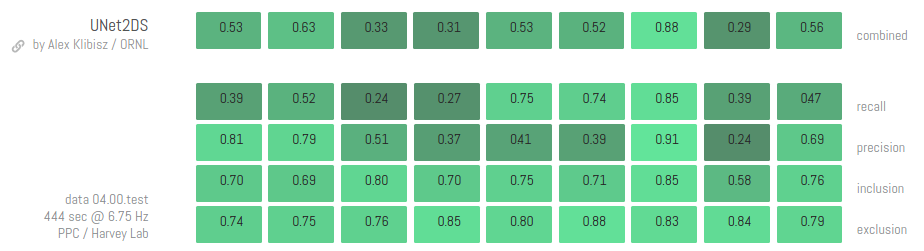

# deep-calcium
Deep Learning Models for Calcium Imaging Data

## Models: Neuron Segmentation

### UNet2DS: UNet with 2D Summary Images

- Slightly-modified UNet model trained on Neurofinder labeled datasets with no problem-specific pre- or post-processing.
- Implemented with Keras using Tensorflow backend.
- [Training, submission artifacts on Dropbox.](https://www.dropbox.com/sh/98u6moeou9bm1yo/AADYDXAIit_DxaxHut9fX0r3a?dl=0)
- [Pre-trained weights `weights_val_dice_squared.hdf5`](https://www.dropbox.com/sh/98u6moeou9bm1yo/AAAQdukECEMw5QU4s9unpyXha/weights_val_dice_squared.hdf5?dl=1), md5sum d2370bc8326aea2e644ff7d696b9798b.

- Latest implementation scored 0.5089 on Neurofinder competition.

- Previous implementation (Keras + Theano) scored 0.5011.

