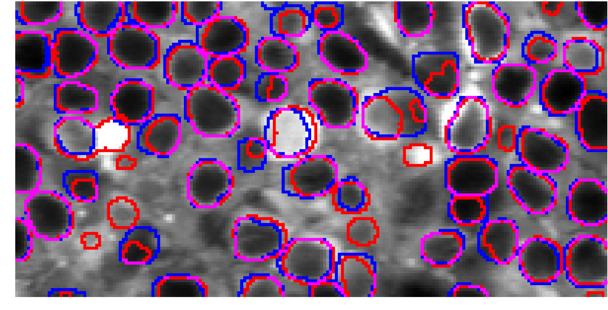
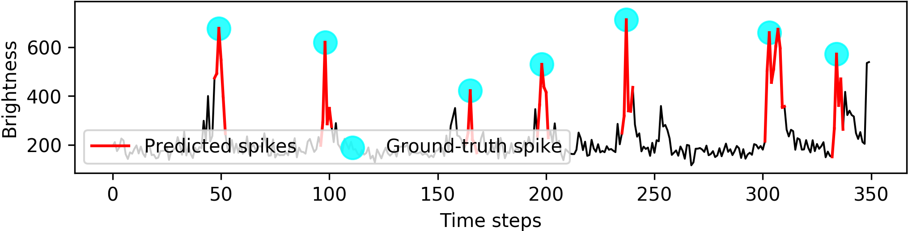

# deep-calcium

Deep Learning Models for Calcium Imaging Data

## Installation and example

Install the package and make predictions on Neurofinder using a pre-trained UNet2DS model.

**Note: This assumes python3.5 and pip3.**

```
# Install from Github repo. Need to upgrade pip.
$ pip install --upgrade --user -I pip
$ pip install --user git+https://github.com/alexklibisz/deep-calcium.git

# Download the model from Github releases.
$ wget https://github.com/alexklibisz/deep-calcium/releases/download/v0.0.1-weights/unet2ds_model.hdf5


# Download the example script and evaluate predictions on the first training dataset.
# This will download and preprocess the dataset to ~/.deep-calcium-datasets, requiring ~3.1GB of disk space.
$ wget https://raw.githubusercontent.com/alexklibisz/deep-calcium/dev/examples/neurons/unet2ds_nf.py
$ CUDA_VISIBLE_DEVICES="0" python unet2ds_nf.py evaluate neurofinder.00.00 --model unet2ds_model.hdf5
```

You should see output similar to this:

```
$ INFO:predict:Loaded model from unet2ds_model.hdf5.
$ INFO:predict:neurofinder.00.00: prec=0.976, reca=1.000, incl=0.084, excl=0.109, comb=0.988
$ INFO:predict:Saved /home/kzh/.deep-calcium/checkpoints/neurons_unet2ds_nf/neurofinder.00.00_mp.png
$ INFO:predict:Mean prec=0.976, reca=1.000, comb=0.988
$ INFO:evaluation:Evaluation without TTA.
$ INFO:predict:Loaded model from unet2ds_model.hdf5.
$ INFO:predict:neurofinder.00.00: prec=0.919, reca=1.000, incl=0.106, excl=0.133, comb=0.958
$ INFO:predict:Saved /home/kzh/.deep-calcium/checkpoints/neurons_unet2ds_nf/neurofinder.00.00_mp.png
$ INFO:predict:Mean prec=0.919, reca=1.000, comb=0.958
```

## Models for Neuron Segmentation

|  | 
|---| 
| *Ground truth and predicted neurons are outlined in blue and red, respectively.  Intersecting outlines become purple.* |

**U-Net2DS: [U-Net](https://arxiv.org/abs/1505.04597) segmenting 2D Summary Images**

- Model described in the paper: [Fast, Simple Calcium Imaging Segmentation with Fully Convolutional Networks](https://arxiv.org/abs/1707.06314) by Aleksander Klibisz, Derek Rose, Matthew Eicholtz, Jay Blundon, Stanislav Zakharenko.
- See notebooks for [figures](https://github.com/alexklibisz/deep-calcium/blob/36bd9d1824b6a44c9eac3bb6ce8e25f913c6a6d5/notebooks/dlmia_workshop_figures.ipynb) and [supplementary material](https://github.com/alexklibisz/deep-calcium/blob/36bd9d1824b6a44c9eac3bb6ce8e25f913c6a6d5/notebooks/dlmia_workshop_supplementary.ipynb).
- Usage with new data: see [this example](https://github.com/alexklibisz/deep-calcium/blob/examples/neurons/unet2ds_sj.py) to understand how to use a trained model with new data.
- Trained on data from the [Neurofinder challenge](http://neurofinder.codeneuro.org/) with results below.

| Date | Summary | Mean F<sub>1</sub> Score | All Scores | Model & Weights | Training Artifacts | Commit |
|---|---|---|---|---|---|---|
|6/16/17|UNet with a single batchnorm layer at the input. Images scaled to [0,1]. |0.5356|[Github](https://github.com/alexklibisz/deep-calcium/blob/dev/media/nf_scores_unet2ds_0.5356.png)|[Google Drive](https://drive.google.com/open?id=0B1ctKflTHUcoMjR4ZHJZNF9CdWM)|[Google Drive](https://drive.google.com/open?id=0B1ctKflTHUcoekR2c05qVjhVR2c)|[0bda9d4](https://github.com/alexklibisz/deep-calcium/commit/0bda9d4b9cad71fb3685671c2e699c88d9195a24)|
|7/12/17|Same as 6/16/17, but with 8x test-time augmentation. |0.5422|[Github](https://github.com/alexklibisz/deep-calcium/blob/dev/media/nf_scores_unet2ds-tta_0.5422.png)|[Google Drive](https://drive.google.com/open?id=0B1ctKflTHUcoMjR4ZHJZNF9CdWM)|[Google Drive](https://drive.google.com/open?id=0B1ctKflTHUcoekR2c05qVjhVR2c)|[f1b33bf](https://github.com/alexklibisz/deep-calcium/commit/f1b33bfe48425d0d7a33f7f74ded19905a24b88f)|
|7/13/17|UNet with batchnorm between each conv and ReLU. Mean subtraction and normalization on each summary image. Mask-summary erosion to eliminate merged neurons in ground-truth mask.|0.5611|[Github](https://github.com/alexklibisz/deep-calcium/blob/dev/media/nf_scores_unet2ds_0.5611.png)|[Github](https://github.com/alexklibisz/deep-calcium/releases/tag/v0.0.1-weights)|[Google Drive](https://drive.google.com/open?id=0B1ctKflTHUcoakJZUFBseVdkdFk)|[2b15d1b](https://github.com/alexklibisz/deep-calcium/blob/2b15d1b07a780ff4b2477524f255e41533fc6205/deepcalcium/models/neurons/unet_2d_summary.py)|
|7/13/17|Same as 7/13/17, but with 8x test-time augmentation. Replaced UNet2DS submission with this one. |0.5689|[Github](https://github.com/alexklibisz/deep-calcium/blob/dev/media/nf_scores_unet2ds-tta_0.5689.png)|[Github](https://github.com/alexklibisz/deep-calcium/releases/tag/v0.0.1-weights)|[Google Drive]([Google Drive](https://drive.google.com/open?id=0B1ctKflTHUcoakJZUFBseVdkdFk))|[2b15d1b](https://github.com/alexklibisz/deep-calcium/blob/2b15d1b07a780ff4b2477524f255e41533fc6205/deepcalcium/models/neurons/unet_2d_summary.py)|

## Models for Spike Segmentation

|  | 
|---| 
| *Ground truth spikes marked in blue, predicted spike segments in red. |

**U-Net1D: 1-dimensional [U-Net](https://arxiv.org/abs/1505.04597) segmenting calcium traces**

- Model described in: [Segmenting Neurons and Spikes in Calcium Imaging Data Using Deep Learning](https://drive.google.com/file/d/0B1ctKflTHUcoM1hWUGRJU1JmdTg/view?usp=sharing) ([poster](https://drive.google.com/file/d/0B1ctKflTHUcoYlNRUkJUek9tVms/view?usp=sharing))
- Currently used for non-public internal data only. It might be adaptable for [Spikefinder data](http://spikefinder.codeneuro.org/). Spikefinder is predicting a continuous output (number of action potentials at each time step). U-Net1D predicts a binary output (spike or no-spike at each time step).
- Trained weights are available on the releases page.
